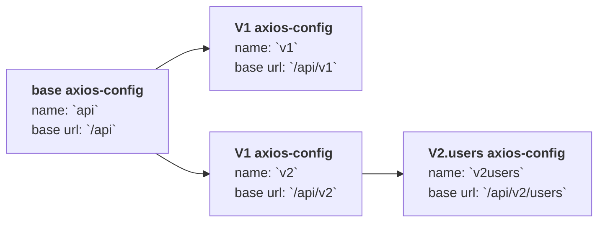

# Requests with layers config manager

It allows you held on hierarchical multi-config for your axios-requests.

**Base units:**

- Request Config Manager: `LayerConfigManager`
- Request Config: `LayerConfig`
- Request: `LayerRequest`

## How it works

Hierarchical configs:



## Basic usage

Add your config and do a request:

```js
import { buildLayerRequest, globalLayerConfigManager } from '@feugene/layer-request'

const apiRequestConfig = {
  axiosRequestConfig: {
    baseURL: '/api',
  }
}

const layerApi = globalLayerConfigManager.addLayer(apiRequestConfig, 'api')

//...
const layerRequest = buildLayerRequest()
const request = layerRequest.useConfig('api')
request.get('users').then(resp => {})  // --> GET '/api/users'

// it's all!
// if you want to extent you config:

globalLayerConfigManager.addCopyFrom(layerApi, (targetConfig, sourceConfig) => {
  targetConfig.axiosRequestConfig.baseURL += '/v2'
  targetConfig.interceptors.response.push(ConsoleResponseInterceptor2)
  targetConfig.extra.test = 'test'
}, 'v2')

// and then call it:
const request = layerRequest.useConfig('v2')
request.get('users').then(resp => {})  // --> GET '/api/v2/users'
```

Basic, without config. This request already contains first Config Layer with name `/`:

```js
import { buildLayerRequest } from '@feugene/layer-request'

const request = buildLayerRequest()
```

Basic, with empty config layer manager or custom config:

```js
import { buildLayerRequest } from '@feugene/layer-request'

const request = buildLayerRequest()
```

You may take over `extra`-data within requests and interceptors:

```js
import { LayerRequest, LayerConfigManager } from '@feugene/layer-request'

const m = new LayerConfigManager()
// ...
const extra = {
  store: { ... },
  dataWrapper: true,
  // ..
}
const request = new LayerRequest(m, extra)
```

## Add new config layer

```js
const r = buildLayerRequest()

const layoutApi = r.manager.addLayer((cm) => cm.new({
  axiosRequestConfig: {
    headers: {
      host: 'localhost',
    },
    baseURL: '/api',
  },
  interceptors: {
    // request: [...],
    response: [ConsoleResponseInterceptor1],
  },
}))

// add another layer
const layoutV1 = r.manager.addCopyFrom(layoutApi, (targetConfig) => {
  targetConfig.axiosRequestConfig.baseURL += '/v1'
  targetConfig.interceptors.response.push(ConsoleResponseInterceptor2)
})

// or 
configForModule1 = r.manager.addLayer((cm) => {
  const copyLayout = cm.copyLayer(layoutV1)

  copyLayout.axiosRequestConfig.baseURL += '/module1'

  return copyLayout
})
```

Create new layer by coping from existing layer and add it to the manager.

```js
r.manager.addCopyFrom('/api', (targetConfig) => {
  targetConfig.axiosRequestConfig.baseURL += '/v2'
})
// or
r.manager.addCopyFrom(layoutApi, (targetConfig) => {
  targetConfig.axiosRequestConfig.baseURL += '/v3'
})
```

Create config layer with custom name `front`

```js
r.manager.addLayer((cm) => cm.copyLayer('/api'), 'front')
```

Update existing config layer by name (`/api`)

```js
r.manager.updateLayer('/api', (cl) => {
  cl.axiosRequestConfig.baseURL = '/api/admin'
})
```

## Use a request with defined config

```js
const configId = 'api' // type of <string> or <LayerConfig>
const request = r.useConfig(configId)
request.post('store', { key: 1 }) // it'll do POST request on url `/api/v1/module1/store`
request.get('/') // it'll make GET request on url: `/api/v1/module1`

const request = r.useConfig('/api/v2')
request.get('app/users')  // --> GET '/api/v2/app/users'
  .then(resp => {
  })

request.post('app/users/12')  // --> POST '/api/v2/app/users/12'
  .then(resp => {
  })
```  
